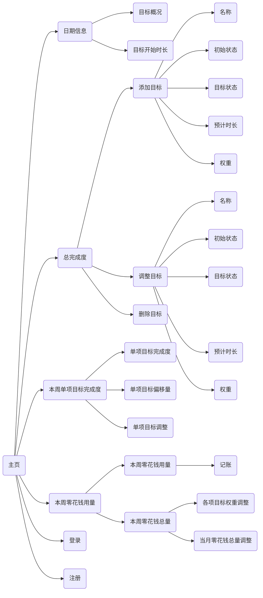

```mermaid
graph LR
A(主页)--> AA(日期信息)
AA--> AAA(目标概况)
AA--> AAB(目标开始时长)
A--> AB(总完成度)
AB--> ABA(添加目标)
ABA-->ABA1(名称)
ABA-->ABA2(初始状态)
ABA-->ABA3(目标状态)
ABA-->ABA4(预计时长)
ABA-->ABA5(权重)
AB--> ABB(调整目标)
ABB-->ABB1(名称)
ABB-->ABB2(初始状态)
ABB-->ABB3(目标状态)
ABB-->ABB4(预计时长)
ABB-->ABB5(权重)
AB --> ABC(删除目标)
A-->AC(本周单项目标完成度)
AC--> AC1(单项目标完成度)
AC--> AC2(单项目标偏移量)
AC--> AC3(单项目标调整)
A-->AD(本周零花钱用量)
AD-->ADA(本周零花钱用量)
ADA--> ADA1(记账)
AD-->ADB(本周零花钱总量)
ADB-->ADB1(各项目标权重调整)
ADB-->ADB2(当月零花钱总量调整)
A-->AE(登录)
A-->AF(注册)
```

